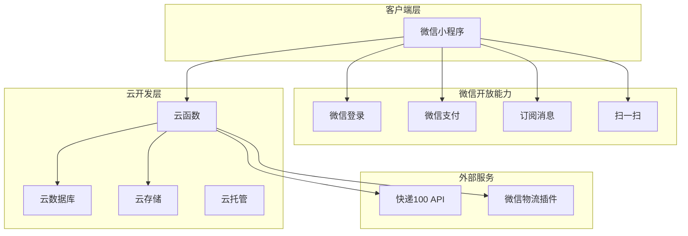

# 农产品销售管理微信小程序 - 技术架构文档

## 1. 系统架构设计

### 1.1 整体架构图


### 1.2 分层架构
```
┌─────────────────────────────────┐
│        视图层 (Vue.js)          │
│   pages/ + components/         │
├─────────────────────────────────┤
│        业务逻辑层 (JavaScript)   │
│   stores/ + services/           │
├─────────────────────────────────┤
│        数据访问层 (云函数)       │
│   cloudfunctions/              │
├─────────────────────────────────┤
│        云数据库 (MongoDB)        │
│   collections/                 │
└─────────────────────────────────┘
```

## 2. 技术选型

### 2.1 前端框架
- **框架**：Uni-app + Vue 3 + TypeScript
- **状态管理**：Pinia
- **样式方案**：SCSS + CSS变量
- **图表库**：ECharts (小程序适配版)
- **UI组件**：uView UI（轻量级）

### 2.2 后端服务
- **运行环境**：微信云开发（Node.js 12.x/14.x）
- **触发器**：云函数触发器、定时触发器
- **缓存**：云开发内置缓存

### 2.3 数据库设计
基于微信云开发 MongoDB

#### 集合：users（用户表）
```javascript
{
  _id: ObjectId,
  openid: String,           // 微信openid
  role: String,            // 'owner' | 'writer' | 'shipper' | 'browser'
  nickname: String,        // 昵称
  phone: String,           // 手机号
  farm_id: String,         // 所属农场ID
  invite_code: String,     // 邀请码
  created_at: Date,
  updated_at: Date
}
```

#### 集合：products（产品表）
```javascript
{
  _id: ObjectId,
  farm_id: String,
  name: String,            // 产品名称（车厘子、枇杷）
  image: String,           // 产品主图
  maturity_cycle: Number,  // 熟制周期（年成熟次数：1/2/N）
  description: String,     // 产品描述
  status: String,          // 'active' | 'inactive'
  specifications: [
    {
      name: String,        // 规格名称（大果、中果、小果）
      weight: String,      // 重量（2斤、5斤）
      price: Number,       // 单价
      stock: Number        // 库存
    }
  ],
  created_at: Date,
  updated_at: Date
}
```

#### 集合：orders（订单表）
```javascript
{
  _id: ObjectId,
  order_no: String,        // 订单编号
  farm_id: String,
  writer_id: String,       // 填写人ID
  writer_name: String,     // 填写人昵称
  
  // 收货信息
  receiver_name: String,
  receiver_phone: String,
  province: String,
  city: String,
  district: String,
  address: String,         // 详细地址
  
  // 商品信息
  products: [
    {
      product_id: ObjectId,
      product_name: String,
      spec_name: String,
      spec_id: String,
      quantity: Number,
      unit_price: Number,
      subtotal: Number
    }
  ],
  
  // 费用信息
  subtotal: Number,        // 商品小计
  shipping_fee: Number,    // 运费
  discount: Number,        // 优惠金额
  coupon_id: String,       // 使用的优惠券
  total: Number,          // 订单总额
  
  // 状态和物流
  status: String,          // 'pending' | 'shipped' | 'delivered' | 'completed'
  shipping_company: String,// 物流公司
  tracking_no: String,     // 物流单号
  
  // 发货信息
  photo_fruit: String,     // 水果照片URL
  photo_order: String,     // 订单截图URL
  shipped_at: Date,        // 发货时间
  delivered_at: Date,      // 收货时间
  
  // 物流轨迹
  tracking_history: [
    {
      time: Date,
      status: String,
      description: String
    }
  ],
  
  remarks: String,         // 备注
  created_at: Date,
  updated_at: Date
}
```

#### 集合：shipping_rules（邮费规则表）
```javascript
{
  _id: ObjectId,
  farm_id: String,
  province: String,        // 省份（空=全国）
  city: String,            // 城市（空=全省）
  specification_id: String,// 规格ID（空=通用）
  base_fee: Number,        // 基础运费
  extra_fee_per_kg: Number,// 每增加1kg加价
  free_shipping_threshold: Number, // 包邮门槛（重量kg）
  is_free: Boolean,        // 是否包邮
  priority: Number,        // 优先级（数字越大优先级越高）
  created_at: Date
}
```

#### 集合：coupons（优惠券表）
```javascript
{
  _id: ObjectId,
  farm_id: String,
  type: String,            // 'new_user' | 'review' | 'invite'
  name: String,            // 优惠券名称
  amount: Number,          // 优惠金额
  min_purchase: Number,    // 最低消费
  valid_days: Number,      // 有效期天数
  user_id: String,         // 持有人（空=未发放）
  status: String,         // 'unused' | 'used' | 'expired'
  used_order_id: String,   // 使用的订单ID
  created_at: Date,
  used_at: Date,
  expired_at: Date
}
```

#### 集合：invites（邀请关系表）
```javascript
{
  _id: ObjectId,
  farm_id: String,
  inviter_id: String,      // 邀请人ID
  inviter_name: String,
  invitee_id: String,     // 被邀请人ID
  invitee_name: String,
  invitee_order_id: String,// 被邀请人首单订单ID
  reward_coupon_id: String,// 奖励优惠券ID
  reward_status: String,  // 'pending' | 'granted' | 'failed'
  created_at: Date
}
```

#### 集合：farms（农场配置表）
```javascript
{
  _id: ObjectId,
  name: String,            // 农场名称
  owner_id: String,        // 所有者ID
  contact_phone: String,
  address: String,
  logo: String,
  settings: {
    free_shipping_enabled: Boolean,
    free_shipping_threshold: Number,
    max_coupons_per_order: Number, // 优惠券叠加上限
    invite_reward_rules: [
      { count: Number, amount: Number }
    ]
  },
  created_at: Date,
  updated_at: Date
}
```

## 3. 云函数设计

### 3.1 云函数列表
| 云函数名 | 功能 | 触发方式 |
|---------|------|---------|
| login | 用户登录/注册 | 客户端调用 |
| getUserInfo | 获取用户信息 | 客户端调用 |
| getProducts | 获取产品列表 | 客户端调用 |
| createOrder | 创建订单 | 客户端调用 |
| getOrders | 获取订单列表 | 客户端调用 |
| updateOrder | 更新订单状态 | 客户端调用 |
| uploadPhoto | 上传照片 | 客户端调用 |
| getShippingFee | 计算运费 | 客户端调用 |
| queryLogistics | 查询物流 | 客户端调用 |
| createCoupon | 创建优惠券 | 客户端调用 |
| useCoupon | 使用优惠券 | 客户端调用 |
| processInvite | 处理邀请关系 | 订单创建触发 |
| sendSubscribeMessage | 发送订阅消息 | 云函数内部调用 |
| getStatistics | 获取统计数据 | 客户端调用 |
| generateShareLink | 生成授权分享链接 | 客户端调用 |

### 3.2 核心云函数实现

#### login 云函数
```javascript
// 微信云函数：用户登录
// 1. 获取微信openid
// 2. 查询/创建用户记录
// 3. 返回用户角色和权限
// 4. 处理首次登录发放新用户券
```

#### createOrder 云函数
```javascript
// 创建订单流程：
// 1. 验证用户权限（填写人或果园所有者）
// 2. 计算商品总价
// 3. 计算运费（调用getShippingFee）
// 4. 应用优惠券
// 5. 创建订单记录
// 6. 发送订阅消息通知发货人
// 7. 处理邀请关系（首次下单）
```

#### getShippingFee 云函数
```javascript
// 运费计算逻辑：
// 1. 查询匹配地区的邮费规则（按优先级排序）
// 2. 如果有规格特定规则，使用规格规则
// 3. 计算基础运费 + 超重费用
// 4. 检查包邮条件
// 5. 返回运费金额
```

## 4. 微信订阅消息配置

### 4.1 订阅消息模板
- **订单发货通知**：物流单号、物流公司
- **物流状态更新**：当前状态、地点
- **异常提醒**：滞留/退回通知

### 4.2 订阅触发时机
- 用户下单时请求订阅
- 订单状态变更时发送

## 5. 物流跟踪实现

### 5.1 快递100 API集成
```javascript
// 查询快递轨迹
POST https://api.kuaidi100.com/poll/query.do
{
  "customer": "xxx",
  "sign": "xxx",
  "param": {
    "com": "yuantong",
    "num": "YT123456789",
    "resultv2": "1"
  }
}
```

### 5.2 物流轨迹展示
- 使用 ECharts 绘制时间轴曲线
- 节点展示：揽收、运输中、派送中、已签收
- 当前状态高亮显示

## 6. 图片处理

### 6.1 Canvas水印实现
```javascript
// 为水果照片添加水印：
// 1. 时间水印：当前日期时间
// 2. 地理位置水印（调用wx.getLocation）
// 3. 订单号水印
```

### 6.2 上传要求
- 照片1（水果照片）：必填，建议添加水印
- 照片2（订单截图）：必填，用于系统识别
- 支持格式：JPEG、PNG
- 最大尺寸：2MB

## 7. 权限控制矩阵

| 功能 | 果园所有者 | 填写人 | 发货人 | 外部浏览者 |
|------|-----------|--------|--------|-----------|
| 商品配置 | ✅ | ❌ | ❌ | ❌ |
| 创建订单 | ✅ | ✅ | ❌ | ❌ |
| 查看所有订单 | ✅ | ✅(仅自己) | ✅ | ❌ |
| 发货操作 | ✅ | ❌ | ✅ | ❌ |
| 查看物流 | ✅ | ✅(仅自己) | ✅ | ✅(需授权) |
| 优惠券管理 | ✅ | ❌ | ❌ | ❌ |
| 统计数据 | ✅ | ❌ | ❌ | ❌ |

## 8. 目录结构

```
CherryGo/
├── pages/                      # 页面
│   ├── index/                  # 发货人工作台（首页）
│   ├── products/
│   │   ├── list/               # 商品列表
│   │   ├── detail/             # 商品详情
│   │   └── config/             # 商品配置
│   ├── orders/
│   │   ├── create/             # 创建订单
│   │   ├── detail/             # 订单详情
│   │   ├── logistics/           # 物流跟踪
│   │   └── track/              # 物流查询
│   ├── mine/                  # 个人中心
│   └── stats/
│       └── dashboard/          # 统计看板
├── components/                  # 组件
│   ├── ProductCard/
│   ├── OrderCard/
│   ├── PhotoUploader/
│   ├── LogisticsTimeline/
│   └── CouponCard/
├── stores/                     # Pinia状态管理
│   ├── user.js
│   ├── product.js
│   ├── order.js
│   └── cart.js
├── services/                   # 业务服务层
│   ├── api.js                  # API封装
│   ├── auth.js                 # 认证服务
│   ├── logistics.js            # 物流服务
│   └── coupon.js               # 优惠券服务
├── cloudfunctions/             # 云函数
│   ├── login/
│   ├── createOrder/
│   ├── getShippingFee/
│   └── queryLogistics/
├── utils/                      # 工具函数
│   ├── request.js              # 请求封装
│   ├── storage.js              # 本地存储
│   └── format.js               # 格式化函数
├── static/                     # 静态资源
│   └── images/
├── styles/                     # 公共样式
│   ├── variables.scss
│   └── common.scss
├── manifest.json               # Uni-app配置
├── pages.json                  # 路由配置
└── package.json
```

## 9. 开发优先级与里程碑

### Phase 1: MVP (当前阶段)
- ✅ 用户认证与角色识别
- ✅ 商品列表与详情
- ✅ 订单创建与提交
- ✅ 发货人工作台
- ✅ 基础物流查询

### Phase 2: 增强功能
- ✅ 订阅消息通知
- ✅ 物流历史曲线
- ✅ 授权分享功能

### Phase 3: 营销功能
- ✅ 优惠券系统
- ✅ 邀请返利
- ✅ 统计看板

## 10. 安全考虑

- **邀请返利限制**：仅限一级分销，禁止多级
- **数据加密**：敏感信息（手机号、地址）加密存储
- **权限验证**：每个云函数验证用户角色和权限
- **防刷机制**：订单创建频率限制
- **日志审计**：关键操作记录日志

## 11. 性能优化

- **图片压缩**：上传前客户端压缩
- **懒加载**：列表页分页加载
- **缓存策略**：商品信息缓存
- **云函数优化**：减少数据库查询次数
